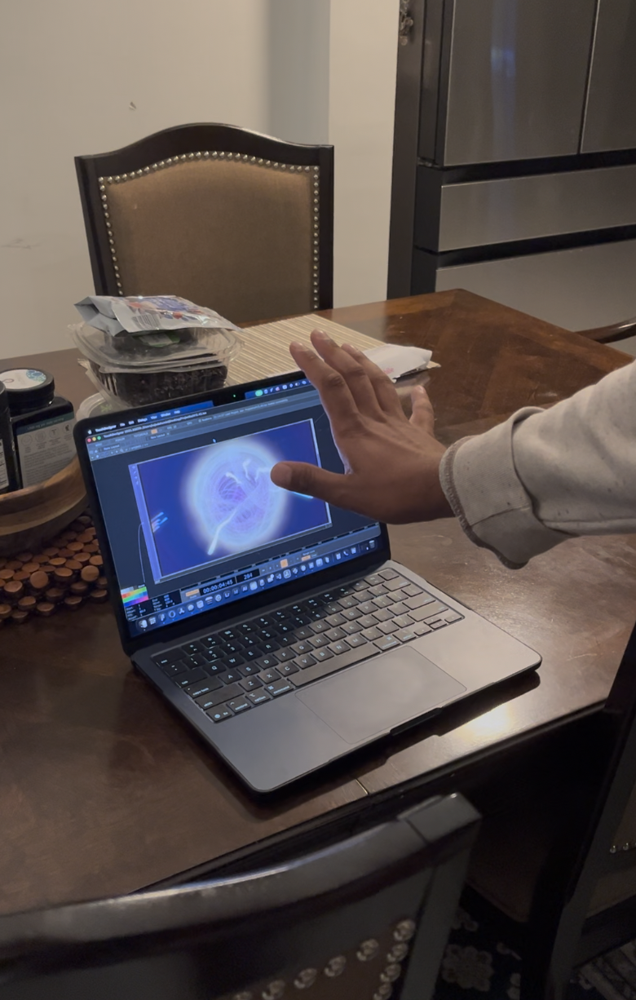

# Build Log

Honest notes, newest at the bottom. Each entry says what I asked for and what Claude actually did,
plus whatever broke badly enough to be worth remembering.

---

## Sept 9 — Started

Repo created. No idea yet what the piece is.

---

## Sept 14 — Brainstorming

Started by talking it through rather than building. I had three fixed points: a janky projector, a
classroom whose lights can go off, and wanting projection mapping in my portfolio. The
concept itself was wide open.

**What Claude did:** surveyed interactive projection works and sorted them by what one projector, one
webcam and a MacBook Air can actually reach — Text Rain, Snibbe's *Shadow*, *Shadow Monsters* in
range; Hakanaï and architectural mapping out of range without more hardware. That list is in
`docs/reference-interactive-projection-works.md`.

The takeaway that shaped everything after: **none of the good ones explain themselves.** No labels, no
"wave here." You walk into a beam, your shadow does something it shouldn't, and you learn the rule in
four seconds.

I sketched two ideas of my own — a panel you slide through scenes and throw onto the wall, and
a spirit version of yourself that leaves your body when you hold still. Picked the spirit one.

---

## Sept 15 — Getting Claude into TouchDesigner

**What I asked for:** connect the MCP server so Claude could build inside my project directly.

Went with `8beeeaaat/touchdesigner-mcp` v2.0.0 because it can read node errors *and* send a rendered
image back, so Claude can see what it built instead of guessing.

**What broke:** the installer needed Node 20+, which Claude had wrongly said it didn't. `brew install node`
fixed it. Then the tools appeared but every call gave `ECONNREFUSED` — because there are two halves,
and installing the Claude side doesn't start the TouchDesigner side. Dragging in `mcp_webserver_base.tox`
finished it.

About 30 minutes, most of it waiting on Homebrew.

---

## Sept 15 — The motion detector

**What I asked for:** reduce the whole camera feed to one number — how much did this frame change.
Everything downstream runs off that.

**What Claude built:** camera → monochrome → downsample to 160x90 → compare against a frame 4 back →
average to a single pixel → remap to 0–1 → `MOTION`.

Measured: still reads 0.0005, moving reads 0.012. A 20× gap, which is comfortable. **These numbers are
room-specific and have to be re-measured on site** — that's a build step, not a formality.

**The major problem, and it's the theme of this whole project: TouchDesigner fails silently.** Nine
things went wrong this session and only three produced an error. The two worth remembering:

- **Cache Select's index counts backwards.** Setting it to `1` for "one frame back" silently clamped
  to `0`, so the chain was comparing the current frame against itself. Result: always exactly zero —
  which is *also* what a correctly working detector reads in a still room. Only waving exposed it.
- **Camera fps vs project fps.** The webcam runs at 30, TouchDesigner cooks at 60, so half the frames
  are duplicates and the difference is zero. Fixed by comparing 4 frames back instead of 1.

Every silent bug was caught the same way: **compare the picture against the number.** When the diff
rendered pure black while the number insisted 0.545, one of them was lying.

Also worth keeping: the raw difference output — a glowing edge-outline of a moving body on black —
already looked like the piece. The debug view was the aesthetic.

---

## Sept 15 — The state machine

**What I asked for:** turn that number into behavior. Hold still, a charge builds, something releases.
Move, it comes back.

**What Claude did:** wrote it in Python in an Execute DAT rather than with CHOPs, because a CHOP
integrating a rate accumulates without bound — stand still for 60 seconds and it takes forever to
unwind. The Python version keeps the state bounded and puts four tunables at the top of the file:

```python
THRESH = 0.15   # motion above this counts as moving
HOLD   = 3.0    # seconds of stillness before release
FILL   = 1.0    # charge gained per second while still
DRAIN  = 0.7    # charge lost per second while moving
```

`DRAIN` is slower than `FILL` on purpose — twitch and you lose a little progress, not all of it.
Forgiving rather than punishing. That's a design decision, not a technical one.

Worked first try. Tested it properly anyway.

---

## Sept 15 — The glow, and a test rig that can't validate it

**What I asked for:** make the charge visible — silhouette outlined in light, brightening as it builds.

**The design problem first:** the motion chain only sees you while you're moving, and goes black when
you stop, which is exactly when the glow should appear. So the silhouette needs its own source.
Claude used background subtraction — freeze an empty-room frame, and anything different is a person.

**The major problem:** background subtraction needs a camera that doesn't move and light that doesn't
change, and a laptop on a soft surface fails both. Turning off auto-exposure and auto-white-balance
was a huge single-parameter improvement, but sub-pixel shake still traced every edge in the room.

**This is a test-rig limitation, not a design flaw.** In the real install — projector on a wall,
camera fixed beside it — a person in the beam is a dark shadow against bright light, which is a plain
luminance threshold. The hardest part of that night is a problem the actual piece doesn't have.

Non-negotiable going forward: the camera goes on a tripod.

---

## Sept 15 — Variant B: stillness dissolves you

**What I asked for:** a second file testing the opposite reading — hold still and your own body grains
apart into particles, instead of a copy peeling off. Look borrowed from @stormypyeatte's point-cloud
reel.

One idea does all the work: **the noise threshold rises with the dissolve amount.** At 0 almost every
noise pixel passes and the body is solid; at 1 only the top 5% survive and you're a scatter of points.
No particle system, no crossfade between two layers — one parameter.

**Best accident of the session:** the silhouette is motion-derived, so standing still would erase the
body before it could dissolve. The fix was a cache that latches the last shape the instant the
dissolve starts. Which means what disperses is your *afterimage*, not you. Better than what I set out
to build.

**Biggest visual win, and it was one menu:** turning the colour ramp from horizontal to vertical. A
standing body only samples the narrow middle of a horizontal ramp, so everything came out one muddy
olive. Vertically it samples the whole spectrum head to foot.

Also added a bench mode — a circle shape that stands in for a body — so the look could be tuned
without depending on whether the camera could see a person. Took ten minutes after that.

---

## Sept 15 — Variant C: the pivot to hands

**What I asked for:** an enchanted crystal I move and shatter with hand gestures.

**Naming the pivot plainly, because it matters:** A and B are body pieces on a projector. C is an
object you manipulate, on a screen. **The projector is the thing being dropped** — and a
projection-mapped piece was my whole reason for picking this medium. Either C goes back onto a
projector or it lives alongside A and B. Still undecided.

In its favor: hand tracking is a far more legible affordance than stillness. People understand "reach
out and it responds" instantly.

**The constraint:** TouchDesigner on macOS has no native hand tracking. The route is torinmb's
MediaPipe plugin.

**Smart move Claude made:** wired the whole interaction against a *mouse stub* first, so the
rotate-and-shatter loop was testable before MediaPipe existed on the machine. Swapping in real hands
later was a two-wire change.

---

## Sept 16 — Real hands

Installed the MediaPipe plugin (v0.5.3) as an **external** tox reference, not embedded — the engine
file alone is 172MB and embedding it makes every save crawl.

**Calibrating the pinch — the method is the reusable part.** The grab thresholds were guesses and felt
wrong. You can't measure them in a loop because `time.sleep` blocks TouchDesigner's cook, and a single
sample can't capture a range. So: a temporary script storing a running min/max every frame while a
hand is visible, then just use your hand normally for a while. From 929 frames — firm pinch 0.012,
loose pinch 0.067, open hand 0.234.

**Too sensitive, twice.** The crystal felt like it was swatting away from me. Two rounds of damping
took the gains down roughly 4× from the first guesses, plus a deadzone so tracker jitter can't creep
it. **Lesson: start gesture gains low.** Heavy and slow reads as a solid object. Fast reads as a glitch.

**The major bug of the session.** Hand detection was landing on 10% of frames and the fist gesture had
never once fired — I assumed the recognizer was just unreliable. It wasn't: after a reset, the
component had come back with face landmarks, face detection *and* pose detection all running
alongside gestures at 1280x720. It was doing four kinds of detection to answer one question. Turning
off everything but gestures and dropping to 640x360 took detection to 45% of frames, which is the
practical ceiling. The fist then registered at 0.95 confidence.

**Before any demo:** the MediaPipe engine can restart on its own and come back with a black camera
feed and no detections, silently. The fix is a Reset pulse. Check that before touching anything else.

---

## Sept 21 — Ten concepts

Wrote out ten interaction ideas properly rather than leaving them as sketchbook fragments — head-shake
polls, catching food, a dress-up closet, seasons you scrub through, the gem, the rainbow. Claude wrote
two more: a mirror that dissolves when you look at it and only resolves when you look away, and a
piece that keeps a silhouette of everyone who stood in front of it all day.

In `Concept.md`.

---

## Sept 23 — Rainbow file

**What I asked for:** get `Projectixd415.22.toe` — the motion-driven rainbow piece — into the repo,
since the instructor wants the working file there.

**What Claude did:** added a `!Projectixd415.22.toe` exception to `.gitignore` so this one file gets
through while the rest stay excluded, then read the current parameter values out of the open project
and compared them against what the log last recorded.

**The tuning pass moved everything in one direction: down.** Shorter trails, a higher bar for what
counts as the body, a dimmer resting state, gamma above 1 so only the bright parts of the movement
carry colour. The old numbers were tuned for a laptop screen in a lit room; these are aimed at a
projector in a dark one.

The ramp phase runs on `absTime.seconds * 0.04`, so the colour drifts on its own — a full cycle every
25 seconds, with or without anyone in frame. Two people a minute apart get different colours.

**Still open:** nothing has been measured in the classroom, and the calibration is room-specific. And
I still have to decide whether this file or the crystal is what I would like to continue working on. And over the weekend I would like to try out the changing seasons idea, but to be continued!


---

## Sept 28–29 — Pivot to a 3D model

**What I asked for:** make the rainbow piece more ethereal. Then I brought in a 3D model
(*Evanescent Plasma*, a Sketchfab .glb) and got more interested in exploring it than in my own
silhouette, so I pivoted: dropped the body/shadow layer completely and put the camera *inside* the
model so it feels like an environment you move through, not an object you look at.

**What Claude did:** loaded the .glb, turned off six invisible helper cubes that TouchDesigner was
drawing as a flat grey wall, and made the rings glow instead of reflect. Then built the look off a
reference image I shared: pastel colour, a zoom-smear feedback trail, chromatic fringing, haze and
grain. The first pass was the one I liked. Every "improvement" after it washed it out, so we went
back to it.

**Hand controls.** Brought MediaPipe back in (gestures only, 640x360, same fix as Sept 16). What it
ended up as:

- Open palm, side to side: rotates the model, and a flick keeps it spinning
- Two hands: stretch apart to zoom in, bring together to zoom out
- Pinch + wrist twist: shifts the colours
- Fist: warp burst
- No hands: everything freezes

**Getting there took a lot of tweaking:**

- **Speed, again and again.** Every first guess was too fast. Same lesson as the crystal: start slow.
- **It moved every time a hand came into frame.** Two causes. The model's built-in animation was set
  to resume when a hand appeared, and the tracker's first few frames of a new hand jump around.
  Fixed with a short settle-in delay, ignoring big single-frame jumps, and making a gesture hold a
  few frames before it counts.
- **Gestures that didn't make sense got swapped.** A quick pinch to toggle zoom was unreliable.
  Two-hand zoom felt right but wouldn't zoom out: the tracker loses a hand when they get close, and
  every time it found it again the zoom reset its starting point, so it only ever ratcheted in. Now
  the distance between hands maps straight to depth. Open palm started as a slow look-around, but
  side to side read more naturally as *rotating the thing*.

**Honest concern:** I don't think someone walking up would know what to do. None of these gestures
are discoverable. You have to be told. The reference works I liked (Sept 14) all teach their rule in
a few seconds without labels, and this doesn't yet. That's the next problem to solve: some kind of
on-screen hint, an idle state that invites a hand, or fewer gestures. Hopefully I can get some feedback from class to see what's next.

*Model credit: "Evanescent Plasma" by Tycho Magnetic Anomaly, Sketchfab, CC-BY 4.0.*

---

## Oct 1 — Added sound

When I presented in class I got some ideas from Matt saying that it would be a good idea to add sound
or some noises seeming like the user is plucking the strings of the 3D object, so I included some
sounds. It tends to get annoying over time so I might change it to sound more dreamy. I will know
more when I get my user testing done.

---

## Oct 4 — User testing

I tested a few of my friends and a random person. My friends had never seen it before and they kept
playing with it. It wasn't working sometimes which was weird. It doesn't seem to register some of
them? It seemed like the people with longer fingers had the most problems, which was weird — I don't
know what that's about.

But interaction-wise, they were playing with it a lot longer than I was expecting, comparing it to
feeling like Tony Stark with Jarvis. They played with it for more than 20 minutes, strumming the
strings more than anything. Next thing is I have to try out having a broader sizing for fingertips.



### What Claude worked out about the finger thing

The pinch threshold is an absolute number, not a relative one. MediaPipe reports the thumb-to-index
distance normalized to the *image*, not to the hand. I calibrated it on my own hand back on Sept 16 —
firm pinch 0.012, loose pinch 0.067 — and set `PINCH_ON` at 0.07. My own loose pinch cleared the
threshold by three thousandths. Anyone whose hand is bigger in frame than mine was never going to
make it: their pinch lands around 0.10 and the piece never sees it. Camera distance does the same
thing — stand closer and your hand is larger in frame and harder to register.

It also explains why only pinch broke. Open palm and fist come from MediaPipe's own trained
classifier, which is already hand-size invariant. The one gesture I wrote by hand is the one that
only worked for me.

**The fix:** divide the pinch distance by a reference length on the same hand — wrist to index
knuckle — so the test becomes "fingertips are within X% of hand length" instead of a fixed number.
That's invariant across both hand size and camera distance, which is the broader sizing I was after.
All 21 landmarks are already in `normalized_data`, so it's a few lines in the state machine.

Calibrating on one hand and assuming it generalizes is exactly how this kind of bug survives to a
demo. It only showed up because other people touched it.
